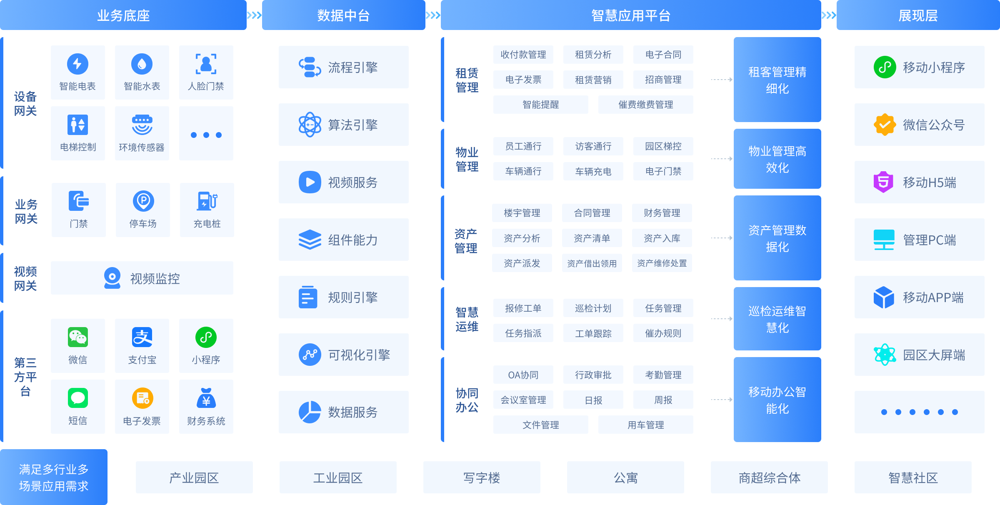
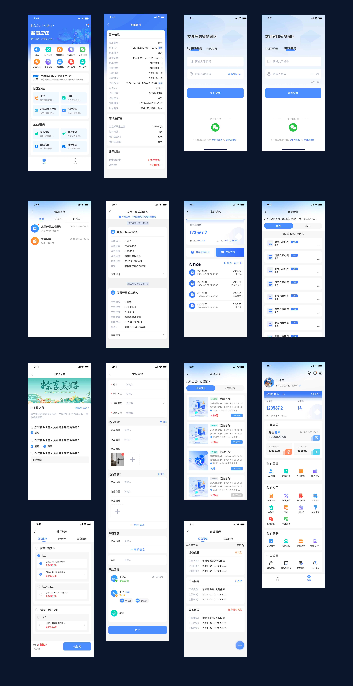

<div align="center" >
    
</div>

<div align="center">

智慧园区智慧楼宇管理系统Java版本

</div>

<div align="center" >
    <a href="https://www.sdyingfeng.cn">
        
    </a>
    <a href="https://www.sdyingfeng.cn">
        
    </a>
     <a href="https://gitee.com/ZhongBangKeJi/CRMEB/repository/archive/master.zip">
        
    </a>
</div>

#### 

<div align="center">

[官网](https://www.sdyingfeng.cn) |
[在线演示](http://yuanqu.sdyingfeng.cn/) |
[帮助文档](https://wiki.sdqingyun.cn/) |
[[宽屏预览](https://gitee.com/qingyun-software/YFPark//blob/master/README.md)] 
</div>
<div align="center">
    如果对您有帮助，您可以点右上角 "Star" ❤️ 支持一下 谢谢！
</div>

---

### 📝 介绍
🔥遥遥领先的开源智慧园区数字园区智慧楼宇系统，框架采用微服务SpringCloud：JDK 17+ Spring Boot 3.2+MySQL+vue3+vite+uniapp；前后台都支持风格切换，包含小程序、H5、公众号、App，，前后端分离，方便二开，使用文档、接口文档、数据字典、代码生成、二开文档/视频教程，各种资料应有尽有，就算你是技术小白，也能轻松上手！
欢迎大家来体验、来提建议，来一起让萤丰智慧园区管理系统更强大，让更多开发者受益！


---

### 🖥 技术特点

```
* Java 后端： JDK 17/21 + Spring Boot 3.2
* 管理后台的电脑端：Vue3 提供 [element-plus](https://gitee.com/yudaocode/yudao-ui-admin-vue3)、[vben(ant-design-vue)](https://gitee.com/yudaocode/yudao-ui-admin-vben) 两个版本
* 管理后台的移动端：采用 [uni-app](https://github.com/dcloudio/uni-app) 方案，一份代码多终端适配，同时支持 APP、小程序、H5！
* 后端采用 Spring Cloud Alibaba 微服务架构，注册中心 + 配置中心 Nacos，定时任务 XXL-Job，服务保障 Sentinel，服务网关 Gateway，分布式事务 Seata
* 数据库可使用 MySQL、Oracle、PostgreSQL、SQL Server、MariaDB、国产达梦 DM、TiDB 等，基于 MyBatis Plus、Redis + Redisson 操作
* 消息队列可使用 Event、Redis、RabbitMQ、Kafka、RocketMQ 等
* 权限认证使用 Spring Security & Token & Redis，支持多终端、多种用户的认证系统，支持 SSO 单点登录
* 支持加载动态权限菜单，按钮级别权限控制，Redis 缓存提升性能
* 高效率开发，使用代码生成器可以一键生成 Java、Vue 前后端代码、SQL 脚本、接口文档，支持单表、树表、主子表
* 实时通信，采用 Spring WebSocket 实现，内置 Token 身份校验，支持 WebSocket 集群
* 集成微信小程序、微信公众号、企业微信、钉钉等三方登陆，集成支付宝、微信等支付与退款
* 集成阿里云、腾讯云等短信渠道，集成 MinIO、阿里云、腾讯云、七牛云等云存储服务
* 集成报表设计器、大屏设计器，通过拖拽即可生成酷炫的报表与大屏
```


###  📱 系统演示

请联系客服获取,客服微信：lhl-bmy-bhw

1、官网介绍：https://yq.sdyingfeng.cn/

2、系统总后台PC端:http://yuanqu.sdyingfeng.cn/


```

使用人群: 总管理员/开发人员
账号: admin   
密码：加客服微信索取

```

3、用户端h5：http://yuanqu.sdyingfeng.cn//h5/?org_id=1   （移动端打开）

```

账号：13395351894  
密码：加客服微信索取  
```


4、管理端h5：http://yuanqu.sdyingfeng.cn/h5_orgs/   （电脑端打开）

```

账号：13395351894  
密码：加客服微信索取
```


> 😜 给项目点点 Star 吧，这对我们真的很重要！
---

###  🔐 安装教程

想要快速安装，教程来助攻！（待完善）

---


---

###  🔐 架构图



---

###  📲 核心功能介绍

#### 1. 智慧物联:

  > 1）、人脸识别门禁：人脸识别门禁抛弃了传统的开门方式，让住户直接“刷脸回家”，设备还支持图片、视频等广告，给物业额外增加收入。<br/>
  > 2）、智慧停车场：实现车库在线缴费、在线查询、自动缴费等功能，提高物业管理效率。停车费支持在线预存，节约停车缴费时间，实现无感出入。<br/>
  > 3）、智能门锁： NB 智能锁，无需网关，安装便捷，链接稳定。支持指纹、IC卡、身份证、密码、远程开锁、使用方便。远程权限下发、修改、删除，有效实现催租催收。开门记录、非法用户、报警信息实时上传，提升居住安全。<br/>
  > 4）、空气质量传感器：有效的监测空气质量数据（温湿度、二氧化碳、pm2.5、pm10等多项空气指标的实时测量数值）。<br/>
  > 5）、智能电表：智能水表，阶梯价管理，定时自动抄表，一键通断电实现催租催收。<br/>
  > 6）、智能水表：智能水表，阶梯价管理，定时自动抄表，一键通断电实现催租催收。<br/>

#### 2.  物业服务：

  > 1）、水电抄表：用量精准计算，避免经营损失，节约人力投入  智能核算账单，一键收缴，解决收费难题 自动派发抄表任务，规范管理流程。 <br/> 
  > 2）、设备巡检：一物一码，即扫即巡，为设备安全保驾护航  在线上报维修工单，优化处理流程，规避企业损失<br/>
  > 3）、绿化检查：制定周期维护计划，确保园区绿化质量。<br/>
  > 4）、保洁检查：保洁任务自动落实，帮助机构更合理的调配人力资源。<br/>
  > 5）、在线报修：对于房屋损坏以及公共设施的损坏，通过在线报修即可完成。 减少了住户去物业报修的次数，物业根据住户提交的维修内容安排维修。<br/>
  > 6）、投诉建议：住户在线上即可对物业进行投诉和表扬，支持自定义配置分类。<br/>
  > 7）、访客管理：业主可在移动端查询最近的访客记录，同时访客到达时候也可以及时收到物业的访客信息 无纸化、快速的登记系统，减轻物业保安人员的投入，加速门口的进出速度"。<br/>
  > 8）、物业活动：线上开展活动报名，提升租客租住体验。<br/>

#### 3.  内部办公:

  > 1）、审批：一站式办公。优化审批流，清晰化工作流，让制度落地。随时随地能审批，流程轻松无负担。覆盖全场景的审批流设计，全面赋能业务需求。<br/>
  > 2）、任务：线上即可完成任务部署，超时情况清晰记录，提高员工工作效率。任务通知到位，减少执勤人疏漏的情况。任务可关联多人员，互相同步执行、了解执行状态。<br/>
  > 3）、日程：在日历中创建备忘工作，自动通知参与人，打造高效工作方式。<br/>
  > 4）、资产管理：资产领用借用等单据记录在案，帮助实现账实统一，减轻管理难度。借助完善的审批流，为楼宇资产保驾护航。<br/>

#### 4.  楼宇运营:

  > 1）、会议室：在线管理会议室，查看会议室状态，便捷关闭/启动会议室，并设置会议室租用价格。租户在线提前预订会议室，避免使用冲突，提升租客办公效率。软硬件结合，打造智能、节能的会议室体验，提升楼宇的商业价值。<br/>
  > 2）、商城：实现园区/公寓等便利店场景，食堂在线点餐，礼品商城等商业变现功能。<br/>
  > 3）、投票问卷：快捷发起内部员工、租客员工、访客游客等不限身份的问卷投票。<br/>
  > 4）、场地预约：用于活动场地、健身房、运动场等按时租赁性质的场地预约，提高场地的收益回报率。<br/>
   
#### 5.  合同管理：
> 合同列表、成本合同、电子合同、合同归档、草稿合同<br/>
#### 6.  财务管理：
   > 所有账单、收支流水、收入列表、收款通知、发票记录、收据记录<br/>
#### 7.  招商管理：
  > 线索池、客户管理、渠道管理、招商分析。<br/>
#### 8.  租客管理：
  >  租客列表、新增租客、租客工商信息、租客员工管理<br/>

……


---

###  📖 UI界面展示



---


###  📕 萤丰公益
做开源，帮助更多人！萤丰开源项目，不仅让开发者从中受益，也在公益活动中帮助了很多人，对此，我们很荣幸，也乐此不疲！

So~~想要用萤丰开源智慧园区系统做公益项目的朋友，可以来免费申请商业版系统哦！有需要的朋友，快去找官方客服咨询吧！


---
###  💎 捐赠
赠人玫瑰，手留余香！萤丰智慧园区诚挚地邀请大家积极参与捐赠，我们会将捐赠获得的费用，悉数用于支持公益项目，让善意无限传递下去！
在此深表感谢~


###  📺 版权须知

Apache License 2.0 许可的主要内容包括：

1. 授权：允许任何人以任何目的使用、复制、修改和分发该软件。

2. 版权声明：要求在软件和相关文档中包含原始版权声明和许可证声明。

3. 保证免责：表明该软件是按现状提供的，没有任何明示或暗示的担保或保证。作者不承担任何赔偿责任。

4. 贡献者授权：要求所有贡献者授予 Apache 软件基金会永久性的、免费的、不可撤销的许可，以使用、复制、修改和分发其贡献。

5. 专利许可：为了保护使用该软件的用户，该许可要求贡献者授权任何必要的专利许可，以便将其用于 Apache 软件基金会的项目。

Apache License 2.0 是一种宽松的开源许可，允许人们自由使用、修改和分发软件。

---
###  💾 版权信息

本项目包含的第三方源码和二进制文件之版权信息另行标注。

版权所有Copyright © 2017-2024 by 萤丰软件

All rights reserved。


---

###  📞 联系我们

如果您对系统有任何疑问或需要咨询，欢迎与我们联系：


客服微信：lhl-bmy-bhw

吕经理： 13241588504（微信同号）

牛经理：15854827610（微信同号）
