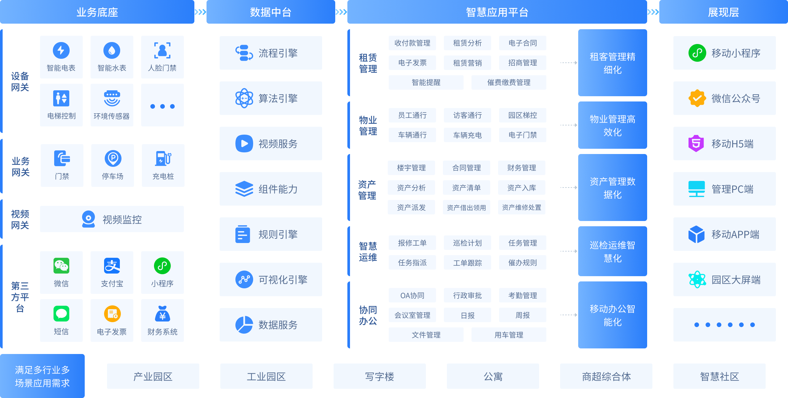
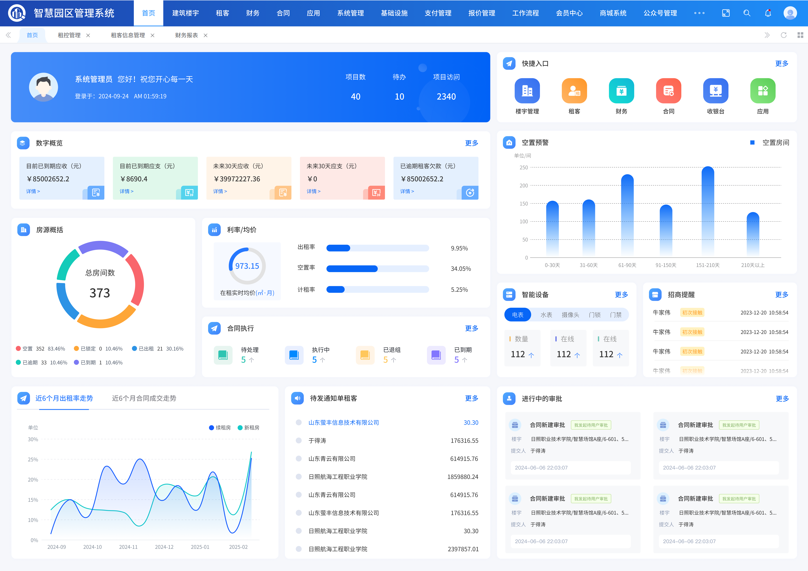
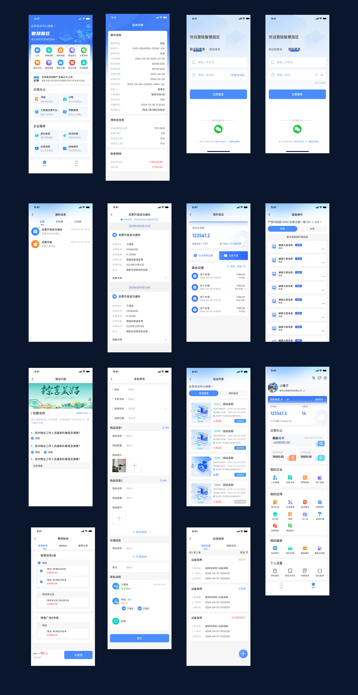

<div align="center" >
    
</div>

<div align="center">

智慧园区智慧楼宇管理系统Java版本

</div>

<div align="center" >
    <a href="https://www.sdyingfeng.com">
        
    </a>
    <a href="https://www.sdyingfeng.cn">
        
    </a>
     <a href="https://gitee.com/ZhongBangKeJi/CRMEB/repository/archive/master.zip">
        
    </a>
</div>

#### 

<div align="center">

[官网](https://www.sdyingfeng.cn) |
[在线演示](http://yuanqu.sdyingfeng.cn/) |
[帮助文档](https://wiki.sdqingyun.cn/) |
[[宽屏预览](https://gitee.com/qingyun-software/YFPark//blob/master/README.md)] 
</div>

<div align="center">
    如果对您有帮助，您可以点右上角 "Star" ❤️ 支持一下 谢谢！
</div>

---

### 📝 介绍
智慧园区管理系统，主要实现园区的资产管理，企业服务及档案管理，人脸门禁、智慧停车场、工单报修、视频监控、智慧巡检、资产管理、财务管理、招商管理、OA办公等等，多维度，多业态助力商业园区以及商业楼宇数字化升级。园区的活动及商城的搭建。 智慧园区是用信息技术为手段、智慧应用为支撑，全面整合园区内外的资源，使园区管理服务等更高效便捷，实现基础设施网络化、管理信息化、功能服务精准化和产业发展智能化， 全面提升园区信息化管理水平。打造城市代言，智慧城市缩影、打造产业基地，谋求跨越发展、传感网、物联网等战略性新兴技术的示范应用；向规模化、集群化、现代化升级、资源集中化，成本优势，规模优势，产业链协同、物流配套畅通


---

### 🖥 智慧园区技术特点

```
* Java 后端： JDK 17/21 + Spring Boot 3.2
* 管理后台的电脑端：Vue3 提供 [element-plus](https://gitee.com/yudaocode/yudao-ui-admin-vue3)、[vben(ant-design-vue)](https://gitee.com/yudaocode/yudao-ui-admin-vben) 两个版本
* 管理后台的移动端：采用 [uni-app](https://github.com/dcloudio/uni-app) 方案，一份代码多终端适配，同时支持 APP、小程序、H5！
* 后端采用 Spring Cloud Alibaba 微服务架构，注册中心 + 配置中心 Nacos，定时任务 XXL-Job，服务保障 Sentinel，服务网关 Gateway，分布式事务 Seata
* 数据库可使用 MySQL、Oracle、PostgreSQL、SQL Server、MariaDB、国产达梦 DM、TiDB 等，基于 MyBatis Plus、Redis + Redisson 操作
* 消息队列可使用 Event、Redis、RabbitMQ、Kafka、RocketMQ 等
* 权限认证使用 Spring Security & Token & Redis，支持多终端、多种用户的认证系统，支持 SSO 单点登录
* 支持加载动态权限菜单，按钮级别权限控制，Redis 缓存提升性能
* 高效率开发，使用代码生成器可以一键生成 Java、Vue 前后端代码、SQL 脚本、接口文档，支持单表、树表、主子表
* 实时通信，采用 Spring WebSocket 实现，内置 Token 身份校验，支持 WebSocket 集群
* 集成微信小程序、微信公众号、企业微信、钉钉等三方登陆，集成支付宝、微信等支付与退款
* 集成阿里云、腾讯云等短信渠道，集成 MinIO、阿里云、腾讯云、七牛云等云存储服务
* 集成报表设计器、大屏设计器，通过拖拽即可生成酷炫的报表与大屏
```


###  📱 智慧园区系统演示

请联系客服获取,（加微信前，先点个star，谢谢）客服微信：lhl-bmy-bhw


1、官网介绍：https://sdqingyun.com/

2、智慧园区系统总后台PC端:https://qypark.sdqingyun.cn/


```
使用人群: 总管理员/开发人员
账号: 13100000000   
密码：加客服微信索取
```

3、智慧园区用户端h5：ttps://qypark.sdqingyun.cn/user_h5/   （移动端打开）


```
账号：19063062535  
密码：加客服微信索取 
``` 


4、智慧园区管理端h5：https://qypark.sdqingyun.cn/admin_h5/   （移动端打开）

```
账号：13100000000  
密码：加客服微信索取
```


> 😜 给项目点点 Star 吧，这对我们真的很重要！
---


###  🔐 智慧园区架构图




---

###  📲 智慧园区核心功能介绍

#### 1. 智慧物联:

  > 1）、人脸识别门禁：人脸识别门禁抛弃了传统的开门方式，让住户直接“刷脸回家”，设备还支持图片、视频等广告，给物业额外增加收入。<br/>
  > 2）、智慧停车场：实现车库在线缴费、在线查询、自动缴费等功能，提高物业管理效率。停车费支持在线预存，节约停车缴费时间，实现无感出入。<br/>
  > 3）、智能门锁： NB 智能锁，无需网关，安装便捷，链接稳定。支持指纹、IC卡、身份证、密码、远程开锁、使用方便。远程权限下发、修改、删除，有效实现催租催收。开门记录、非法用户、报警信息实时上传，提升居住安全。<br/>
  > 4）、空气质量传感器：有效的监测空气质量数据（温湿度、二氧化碳、pm2.5、pm10等多项空气指标的实时测量数值）。<br/>
  > 5）、智能电表：智能水表，阶梯价管理，定时自动抄表，一键通断电实现催租催收。<br/>
  > 6）、智能水表：智能水表，阶梯价管理，定时自动抄表，一键通断电实现催租催收。<br/>

#### 2.  智慧园区之物业服务：

  > 1）、水电抄表：用量精准计算，避免经营损失，节约人力投入  智能核算账单，一键收缴，解决收费难题 自动派发抄表任务，规范管理流程。 <br/> 
  > 2）、设备巡检：一物一码，即扫即巡，为设备安全保驾护航  在线上报维修工单，优化处理流程，规避企业损失<br/>
  > 3）、绿化检查：制定周期维护计划，确保园区绿化质量。<br/>
  > 4）、保洁检查：保洁任务自动落实，帮助机构更合理的调配人力资源。<br/>
  > 5）、在线报修：对于房屋损坏以及公共设施的损坏，通过在线报修即可完成。 减少了住户去物业报修的次数，物业根据住户提交的维修内容安排维修。<br/>
  > 6）、投诉建议：住户在线上即可对物业进行投诉和表扬，支持自定义配置分类。<br/>
  > 7）、访客管理：业主可在移动端查询最近的访客记录，同时访客到达时候也可以及时收到物业的访客信息 无纸化、快速的登记系统，减轻物业保安人员的投入，加速门口的进出速度"。<br/>
  > 8）、物业活动：线上开展活动报名，提升租客租住体验。<br/>

#### 3.  智慧园区之内部办公:

  > 1）、审批：一站式办公。优化审批流，清晰化工作流，让制度落地。随时随地能审批，流程轻松无负担。覆盖全场景的审批流设计，全面赋能业务需求。<br/>
  > 2）、任务：线上即可完成任务部署，超时情况清晰记录，提高员工工作效率。任务通知到位，减少执勤人疏漏的情况。任务可关联多人员，互相同步执行、了解执行状态。<br/>
  > 3）、日程：在日历中创建备忘工作，自动通知参与人，打造高效工作方式。<br/>
  > 4）、资产管理：资产领用借用等单据记录在案，帮助实现账实统一，减轻管理难度。借助完善的审批流，为楼宇资产保驾护航。<br/>
  > 5）、企业公告：工作安排、规章制度、放假通知等企业消息一键群发，实现高效信息传递。<br/>
#### 4.  智慧园区之楼宇运营:

  > 1）、会议室：在线管理会议室，查看会议室状态，便捷关闭/启动会议室，并设置会议室租用价格。租户在线提前预订会议室，避免使用冲突，提升租客办公效率。软硬件结合，打造智能、节能的会议室体验，提升楼宇的商业价值。<br/>
  > 2）、商城：实现园区/公寓等便利店场景，食堂在线点餐，礼品商城等商业变现功能。<br/>
  > 3）、投票问卷：快捷发起内部员工、租客员工、访客游客等不限身份的问卷投票。<br/>
  > 4）、场地预约：用于活动场地、健身房、运动场等按时租赁性质的场地预约，提高场地的收益回报率。<br/>
   
#### 5.  智慧园区之合同管理：
  > 1）、合同列表：所有合同的列表视图查看，支持通过跟进人、创建人、合同编号、起止日期、退租日期、租赁面积、物业面积、合同状态、合同标签、合同类型等进行筛选；支持合同净价、合同面价、合同编号、起止日期、租赁面积、物业面积进行排序；可对合同进行新签、变更、续签、退租、作废、结转、复制到新合同等操作。<br/>
  > 2）、成本合同：机构与业主签订的收房成本合同列表。从业主以成本价租赁房屋，再转租给租客，俗称“二手房东”。<br/>
  > 3）、电子合同：开具过电子合同的集合列表。一键生成电子合同，无纸化线上签署具有法律效应，提升租客体验。<br/>
  > 4）、合同归档：到期合同存档：退租审核通过之后的合同，在退租日的后一天会进入归档合同列表，同时剖面图恢复代表空置的颜色。<br/>
  > 5）、草稿合同：将没有录入完成的合同存入到草稿合同，方便后续继续操作合同。<br/>
  > 6）、合同审核：合同新增、变更、退租等流程的审核配置，配置审核的流程名称、节点、审批人、应用楼宇等配置。<br/>
  > 7）、合同设置：合同条款类型、合同到期提醒、合同打印模板、合同退租协议等配置。<br/>  

#### 6.  智慧园区之财务管理：
  > 1）、所有账单：多类型费用汇总：账单列表包括需要收/付款的各种费用类型的账单；多维度筛选账单：可筛选本期未结清账单、逾期未结清账单、退租未结清账单、自建未结清账单等；自定义统计报表：列表自定义、月报表导出、月度收款明细；多维度查询筛选：支持按起止时间、应收应付、账单结清状态、合同状态等筛选账单。<br/>
  > 2）、收支流水：筛选查找流水记录：可查看收支流水总发生额、完全匹配金额、部分匹配金额、未匹配金额；流水列表：支持按入账日期、发生额、未匹配金额、创建日期排序<br/>
  > 3）、收入列表：记录每一笔收款记录，可根据字段快速筛选查找（租客、房号，合同状态，是否确认，月份）；统计当月应收（含税），当月应收（不含税），当月实收（含税），当月实收（不含税），当月已确定收入，当月待确定收入；收入列表：支持按费用类型、收入类型排序，支持按合同费用类型查看、租客费用类型查看、收入费用类型查看<br/>
  > 4）、收款通知：发出的缴费通知单列表。用于系统根据账单内容自动生成可下载打印的催缴通知单模板，支持显示付款二维码。目前系统支持短信、邮件自动发送缴费通知单，用户可通过链接进行线上缴纳。<br/>
  > 5）、发票记录：支持一键批量开票，极大地提升财务运转效率，减轻开票操作负担。按自定义模板开票：既满足了不同场景不同税率的情况，也解决了反复填写手动运算可能产生疏漏的问题。自动计算生成可开票金额与税额，可一键开具。发票记录与账单相互串联，可跳转可查询。发票详情：可以进行作废与冲红操作发票记录列表：支持购方名称、经办人的搜索，以及楼宇、发票类型、发票状态、申请开票日期的筛选。<br/>
  > 6）、收据记录：支持一键批量开据，开据额度实时同步，避免多开错开。收据编号自动生成，无需对照填写。收据可自行编辑交收款单位、收据编号、支付方式等信息。收据详情：可以生成自定义打印模板，线上线下同步；可进行发出、回收、作废操作。收据记录列表：支持交款单位、收据编号、收款单位、费用名称和开据人的搜索，以及开据日期、收据状态的筛选<br/>
  > 7）、财务设置：发票设置、通知单设置、收据设置等配置。<br/>  

#### 7.  智慧园区之招商管理：
  > 1）、线索池：录入和管理客户提交的招商线索，实现客户线索从待跟进到转客户的全流程管理；配置移动端招商界面，便于将移动端分享给客户，让客户在线查看房源，促进合作。<br/>
  > 2）、客户管理：客户基本信息维护及需求，包括公司/个人信息，行业，来访项目，跟进人，客户来源，需求类型，需求面积，装修需求等。维护客户联系人信息，客户来源渠道信息。查看客户的全部或特定人员特定时间的跟进记录，可以添加跟进说明，设置客户的跟进进程状态、成交几率，并支持设置客户跟进提醒。查看所有客户所处进程状态，包括接触、潜在、意向、成交、流失5个进程状态，查看所有客户成交几率。<br/>
  > 3）、渠道管理：维护自己的第三方招商渠道联系信息，展示该渠道的带看量。<br/>
  > 4）、招商分析：通过客户状态、客户行业、招商渠道、成交渠道、客户需求面积、客户来访量等维度进行对招商分析，利于不断调整招商政策。<br/>


#### 8.  智慧园区之租客管理：
  > 1）、新增租客：租客类别、租客名称、统一社会信用代码、租客行业、纳税等级、年收入；租客所在项目信息、租客类型；租客联系人信息、租客发票信息。<br/>
  > 2）、租客工商信息：调用第三方工商信息系统接口，实现租客基础工商信息抓取。<br/>
  > 3）、租客列表：租客信息概览，包括租客类别、租客名称、租客标签、租客行业、工商数据等。<br/>
  > 4）、租客员工管理：别名“租客子账户”，员工入住到系统后，方便员工后续在移动端使用功能。例如费用账单查看缴纳等。<br/>

……

###  📲 智慧园区移动管理端功能介绍

#### 1. 空间管理:
  > 1）、楼宇信息查看：展示楼栋数、管理面积、在租面积、在租合同数、待租面积。查看基本信息，如楼宇名称、地址、联系方式等。<br/>
  > 2）、项目信息查看：展示项目管理面积、可招商面积、总房源数、可招商房源数。查阅项目基本信息，包括项目名称、位置、项目经理等。<br/>
  > 3）、房源信息查看：查看详细的房源列表，包括每个房源的面积、类型、租金等信息。<br/>
  > 4）、房源剖面图：使用颜色区分展示各个房间的在租情况及租户到期情况。查看每个房间的人员入住情况及基本信息，如租户姓名、联系方式等。<br/>

#### 2. 租客管理:
  > 1）、租客管理：在线查看当前所有入住的租客列表，查阅每位租客的基本信息，如姓名、联系方式等。可以详细查看租客签署的合同及其详情，并查看租客的缴费账单及历史记录。管理和查看相关的附件文件，例如租赁协议、身份证复印件等。<br/>
  > 2）、上门收费管理：支持移动端操作，通过点击对应租客进行费用收取，实时更新租客的缴费状态和账单信息。<br/>
  > 3）、租客员工管理：查看与租客相关的员工信息，包括租客的员工名单及其联系方式。<br/>
  > 4）、租客员工扫码入住：提供扫码功能，用于租客员工的快速入住登记，记录并查看员工的入住时间和基本信息。<br/>

#### 3. 移动招商:
  > 1）、线索池：提供在线领取预约看房的客户线索的功能，并支持员工通过移动端提交自己外拓获得的线索，并进行线索跟进管理。<br/>
  > 2）、客户管理：针对准意向客户进行跟进和管理，包括领取线索和提交新的客户信息。<br/>
  > 3）、渠道管理：支持移动端管理渠道商信息，包括与渠道商的联系和合作状态等。<br/>
  > 4）、招商分析：提供招商活动的数据分析功能，便于上级领导查看客户转化情况和招商业绩。<br/>

#### 4. 审批提醒:
  > 1）、合同审批：合同审批通知将发送给相应的审批人员，允许他们查阅合同内容并进行审批操作。<br/>
  > 2）、租客审批：对租客提交的请求进行审批，确保符合物业管理规定和合同条款。<br/>
  > 3）、资产审批：仓管人员审核员工提交的资产相关请求，例如设备借用或归还。<br/>
  > 4）、工单审批：针对第三方服务商提交的工单，审批相应的付款请求。<br/>
  > 5）、考勤审批：审核员工提交的补卡和请假申请，管理工作时间和考勤记录。<br/>
  > 6）、财务审批：针对账单和财务流程的一系列处理进行审批，确保财务操作合规。<br/>
  > 7）、招商审批：审批涉及渠道商、线索、客户以及招商费用结算的相关申请，支持招商活动的有效管理和监督。<br/>

#### 5. 内部公告:
  > 1）、企业公告通知：接收公司发布的重要公告和通知，确保我及时了解公司动态和相关事项。<br/>
  > 2）、任务待办提醒：查看个人待办任务和已完成任务，帮助我管理工作进度和优先级。<br/>
  > 3）、邮件查阅提醒：及时查看和回复重要邮件，保持与同事和客户的沟通畅通。<br/>
  > 4）、公文查阅提醒：查阅政策通知和部门文件，了解工作任务和执行要求。<br/>
  > 5）、打卡提醒：及时完成打卡，确保我的工作时间记录准确无误。<br/>

#### 6. 在线报修:
  > 1）、在线接单：物业人员可以通过系统接收住户提交的报修请求，确保及时响应和处理。<br/>
  > 2）、在线处理：物业人员能够在系统内直接处理和记录报修请求，以确保问题得到有效解决。<br/>
  > 3）、工单提交：在巡查过程中发现异常或租客拨打电话提出报修申请时，通过系统提交报修工单，包括详细描述问题和紧急程度等信息。<br/>
  > 4）、处理节点查询：提供查询报修处理进度的功能，让我了解问题解决的状态和预计处理时间。<br/>
 
#### 7. 投诉建议:
  > 1）、在线接单：支持员工在线接收住户提交的投诉和建议，确保及时响应和处理。<br/>
  > 2）、在线处理：员工能够在系统内直接处理和记录投诉和建议，以确保问题得到有效解决。<br/>
  > 3）、工单提交：租客拨打电话提出待解决问题时，通过系统提交投诉和建议工单，包括详细描述问题和相关信息。<br/>
  > 4）、处理节点查询：提供查询投诉和建议处理进度的功能，让住户了解问题解决的状态和预计处理时间。<br/>

#### 8. 移动抄表:
  > 1）、在线水电抄表：水电抄表员通过系统接收到待办通知，通知其有新的水电抄表任务需要完成。此时抄表员能够将抄表数据通过系统提交，包括每个房间的具体用量和抄表时间等信息。<br/>

#### 9. 巡更巡检:
  > 1）、待巡检：巡检员通过站内信接收到待巡检任务的通知，确保能及时了解需要进行的巡检工作。点击任务后通过系统填写巡检表单，记录巡检过程中发现的问题和完成的任务。<br/>
  > 2）、已巡检：巡检员可以查看已完成的巡检内容和提交的巡检报告，以便核实和记录巡检的详细信息。<br/>
  > 3）、巡检管理：管理人员可以通过系统查看历史巡检记录和统计数据，了解巡检的执行情况和结果。<br/>

#### 10. 通行证:
  > 1）、核验出入证：租客或访客可以自行提交入园申请，安保人员在线核验通行证，确保访客合规入园。<br/>
  > 2）、绑定出入证：安保人员能够帮助访客将其出入证与申请绑定，以确保访客的出入过程安全和有序。<br/>

#### 11. 场地预约:
  > 1）、核验场地：租客到现场时出示码供工作人员核验，确保有效管理和控制场地使用情况。<br/>
  > 2）、预约单查询：提供查询功能，租客可以查看今日、本月以及所有预约单的核验记录。<br/>

#### 12. 智慧停车场:
  > 1）、云岗亭：云岗亭能够对出入口的车辆进行自动识别和匹配，确保有效的出入管理和车辆放行。<br/>
  > 2）、车场管理：车场管理：提供车场管理人员整体查看在线出场车辆的功能，可以实时监控车辆出入情况。查阅车场实收情况：车场管理人员可以查看整体车场的实际收入情况，包括各种收费项目的收入统计和明细。查阅收费员实收情况：提供各收费员的实际收入情况查询，帮助管理人员了解个体工作表现和收入情况。相机在线状态查阅：管理人员能够查阅相关监控相机的整体在线状态，确保设备正常运行和数据安全。<br/>

#### 13. 人脸识别门禁:
  > 1）、查询设备状态：管理人员可以查阅人脸识别设备的在线状态，确保设备正常运行和数据安全。<br/>
  > 2）、人员出入记录：记录和管理人员可以查阅通过人脸识别门禁系统的人员出入记录，包括时间和门禁位置。<br/>
  > 3）、设备重启：管理人员可以远程控制人脸识别设备进行重启操作，以解决设备问题或更新配置。<br/>
  > 4）、同步人员信息：管理人员能够通过系统同步更新人员的信息和权限，确保门禁系统的准确性和安全性。<br/>

#### 14. 智能门锁:
  > 1）、门锁设备管理：管理人员可以查看项目下所有门锁的信息和在线状态，确保设备正常运行。<br/>
  > 2）、密码设置：管理人员能够通过系统设置和管理门锁的密码，以确保安全性和便利性。<br/>
  > 3）、远程开门：管理人员可以远程控制门锁进行开门操作，方便对访客和特定人员的访问控制。<br/>
  > 4）、开锁记录查询：提供开锁记录的查询功能，管理人员可以查看历史的开锁记录和操作详情。<br/>

###  📲 智慧园区移动用户端功能介绍

#### 1. 在线看房:
  > 1）、房源筛查：租客可以根据个人需求，通过系统快速筛选符合条件的房源，包括区域、面积、价格和装修情况等，以便找到最符合需求的住宅选择。<br/>
  > 2）、预约看房：租客可以通过提交联系电话，方便招商人员与其取得联系，安排看房时间。这种预约方式保证了租客和招商人员之间的高效沟通和服务安排。<br/>
  > 3）、在线咨询：我们对接了企业微信，使招商人员能够直接在线与意向客户沟通。租客可以及时获取关于房源、园区设施以及租赁条款等方面的实时资讯，并通过在线答疑解决疑问。<br/>

#### 2. 企业账单:
  > 1）、余额管理：用户可以直接查看企业账户的余额和剩余预存费用额度，实时了解资金情况。<br/>
  > 2）、优惠券管理：通过领取优惠券，企业用户可以在预约会议室、场地等服务时享受折扣，系统支持领取和使用情况的查看。<br/>
  > 3）、本月总支出：显示本月的总支出金额，帮助企业快速掌握支出情况和财务健康状况。<br/>
  > 4）、上月总支出：显示上月的总支出金额，帮助企业快速掌握支出情况和财务健康状况。<br/>
  > 5）、人员管理：企业管理员可以查阅和审批企业员工在园区内的入住申请，确保管理和使用的有效性和安全性。<br/>
  > 6）、访客记录：记录并查阅所有访客的来访情况，提供安全管理和访客流量统计的便利。<br/>
  > 7）、费用账单：用户可以查看当前的欠缴和待缴账单，并直接通过移动端口完成支付，付款后可查阅历史缴费记录和详细账单信息。<br/>
  > 8）、账户余额：企业可以通过此功能预存费用，便于后续的账单支付和费用管理，确保业务运营的连续性和便捷性。<br/>
  > 9）、合同管理：查阅和管理与园区管理公司签订的所有合同，包括租赁协议和服务协议等，保证合同履行和权益保障。<br/>
  > 10）、公司代付：企业可以设置员工使用园区服务时可以挂靠在公司账单支付，实现统一费用管理和报销流程，提高管理效率。<br/>
  > 11）、开票管理：设置开票账户信息并在线申请开票，为企业提供财务报销和结算的便利。<br/>

#### 3. 在线服务:
  > 1）、租客资讯：随时获取最新的园区资讯和重要活动通知，确保您不会错过任何重要信息。<br/>
  > 2）、物业活动：参与并管理各类社区活动，如社区聚会和节庆庆祝，促进租客之间的互动和社区生活的活跃。<br/>
  > 3）、租客论坛：在论坛上与其他租客分享经验、提出建议，并解决问题，共同促进社区凝聚力和友好氛围。<br/>
  > 4）、商城：方便快捷地在线购物，购买日常生活用品和服务，享受便捷的购物体验。<br/>
  > 5）、预约拜访：通过预约系统安排访客的拜访，提升访客管理和安全性。<br/>
  > 6）、在线报修：便捷地提交维修请求，快速解决房屋和设施的问题，确保您的居住舒适度。<br/>
  > 7）、投诉建议：提供投诉渠道，确保您的声音被及时听到和解决，保障您的居住权益。<br/>
  > 8）、场地预约：轻松预约使用园区内的各类场地，提升您的工作和生活便利性。<br/>
  > 9）、租客申请：针对需要提交申请的服务，提供简便的申请和审批流程，如设备租赁和活动场地使用等。<br/>
  > 10）、招商加盟：有意向成为园区内商业渠道的机构可以申请加入，推荐优质企业入驻，享受相应的佣金政策。<br/>
  > 11）、通行管理：处理装修和物品放行申请，管理车辆进出，确保园区内部安全管理的有效性和便捷性。<br/>
  > 12）、车辆管理：管理个人车辆的绑定、处置和月租车服务，便捷查询和缴费管理。<br/>
  > 13）、智能硬件：实时查看水电用量并进行充值、管理安全门锁开门数据和传感器状态，提升居住和工作的便捷性和安全性。<br/>


###  📖 UI界面展示

请联系客服获取,（加微信前，先点个star，谢谢）客服微信：lhl-bmy-bhw





---


###  📞 联系我们

如果您对系统有任何疑问或需要咨询，欢迎与我们联系（（加微信前，先点个star，谢谢））：
<div align="center">
   
</div>
